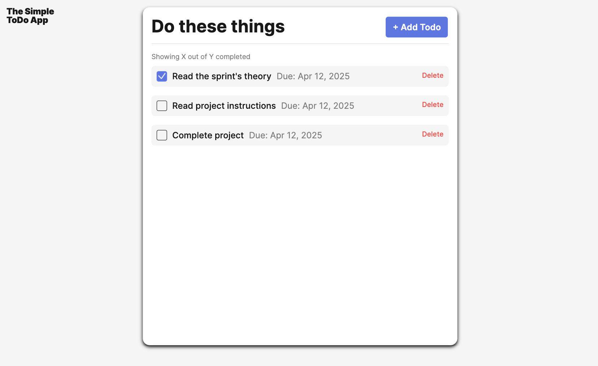
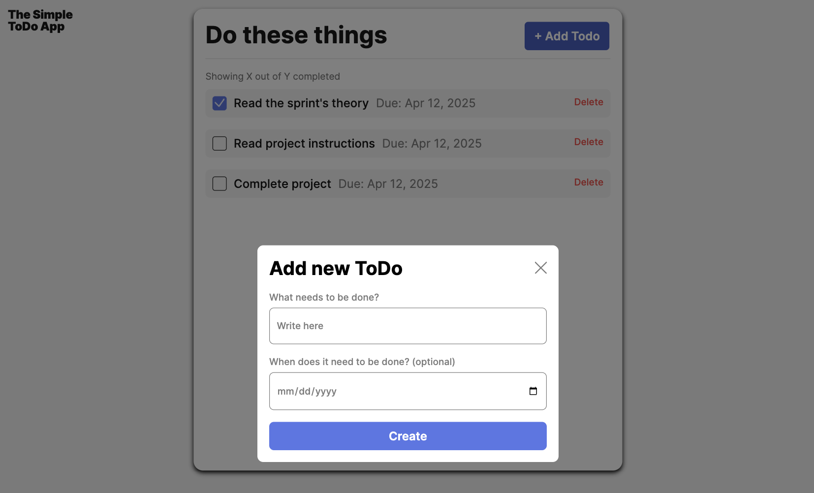

# 📝 Todo List App

A clean, interactive Todo list web app built using vanilla JavaScript.  
Users can add tasks with optional due dates, mark them as complete, and delete them. Form validation ensures a smooth user experience.

---

## 🔍 Project Overview

This Todo app allows users to:

- ✅ Add tasks with optional due dates
- 📅 View formatted due dates
- ❌ Remove tasks
- ✔️ Mark tasks as complete
- ⚠️ Get feedback if the form is incomplete or invalid

The project emphasizes modularity, clean UI, and good front-end development practices.

---

## 🛠️ Tech Stack & Tools

- **HTML5**
- **CSS3** (BEM structure, with reusable blocks)
- **Vanilla JavaScript (ES6 Modules)**

### 📁 Main Components

- `Blocks/`: Reusable CSS blocks (e.g., form, button, todo item)
- `Components/`:
  - `FormValidator.js` – custom form validation class
  - `Todo.js` – manages todo item creation and rendering
- `Utils/`:
  - `constants.js` – stores selectors and configuration objects
- `Pages/`:
  - `index.js` – main logic of the app
  - `index.css` – global styles
- `Vendor/`:
  - `normalize.css` – reset styling
  - `fonts.css` – custom fonts
  - `fonts/` – font files
- `Images/`: Screenshots or media previews
- `.gitignore`: ignores system files like `.DS_Store`
- `.prettierignore`: tells Prettier to skip `normalize.css`
- `index.html`: Main HTML file

---

## 🖼️ Screenshots

---

## 🔗 Live Demo

👉 [View the live app on GitHub Pages](https://github.com/FaridaNelson/se_project_todo-app)

---

## 🚀 How to Run Locally

1. Clone the repository  
   `git clone https://github.com/FaridaNelson/se_project_todo-app`

2. Open `index.html` in a browser  
   No build tools or dependencies needed!

---

Made with ❤️ by Farida Nelson
